# Кластер Couchbase

## Резвертывание кластера

**Запуск приложенного файла docker-compose.yml**\
C:\Users\kos>docker-compose up

**Проверка создания контейнеров**\
C:\Users\kos>docker ps\
CONTAINER ID   IMAGE              COMMAND                  CREATED          STATUS          PORTS                                                                                                                               NAMES\
9a439f5d467e   couchbase:latest   "/entrypoint.sh couc…"   12 minutes ago   Up 12 minutes   8097/tcp, 9123/tcp, 0.0.0.0:8091-8096->8091-8096/tcp, 11207/tcp, 11280/tcp, 0.0.0.0:11210-11211->11210-11211/tcp, 18091-18097/tcp   db_main\
c9296dff87d1   couchbase:latest   "/entrypoint.sh couc…"   12 minutes ago   Up 12 minutes   8091-8097/tcp, 9123/tcp, 11207/tcp, 11210/tcp, 11280/tcp, 18091-18097/tcp                                                           db1\
8697cc54d02d   couchbase:latest   "/entrypoint.sh couc…"   12 minutes ago   Up 12 minutes   8091-8097/tcp, 9123/tcp, 11207/tcp, 11210/tcp, 11280/tcp, 18091-18097/tcp                                                           db2\
3ef24915820e   couchbase:latest   "/entrypoint.sh couc…"   12 minutes ago   Up 12 minutes   8091-8097/tcp, 9123/tcp, 11207/tcp, 11210/tcp, 11280/tcp, 18091-18097/tcp                                                           db3\

**Получение ip-адресов развенутых БД**
C:\Users\kos>docker inspect -f '{{range.NetworkSettings.Networks}}{{.IPAddress}}{{end}}' db_main\
'172.26.0.5'

C:\Users\kos>docker inspect -f '{{range.NetworkSettings.Networks}}{{.IPAddress}}{{end}}' db1\
'172.26.0.3'

C:\Users\kos>docker inspect -f '{{range.NetworkSettings.Networks}}{{.IPAddress}}{{end}}' db2\
'172.26.0.2'

C:\Users\kos>docker inspect -f '{{range.NetworkSettings.Networks}}{{.IPAddress}}{{end}}' db3\
'172.26.0.4'

**Переход на сервер Couchbase**\
Открываем в барузере стрницу http://localhost:8091 \
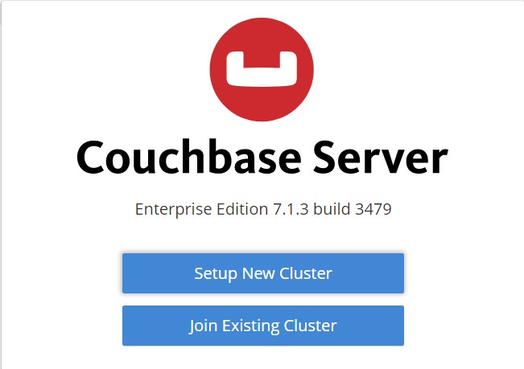 \
Выбираем 'Setup New Cluster' и вводим название кластера и данные администратора \
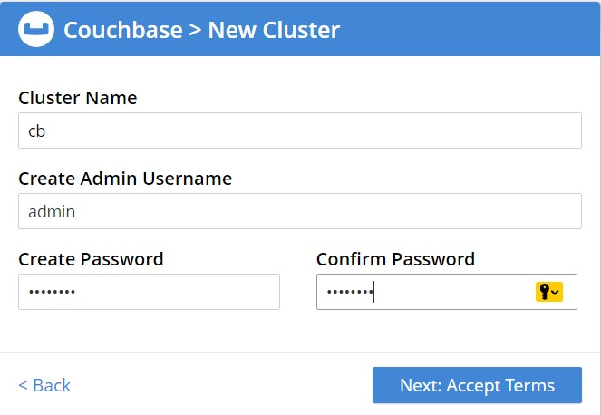\
Создаем кластер на основе инстанса сервера db_main\
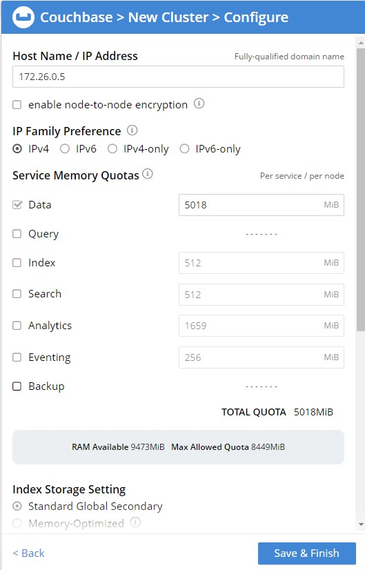 \
Результаты создания кластера 
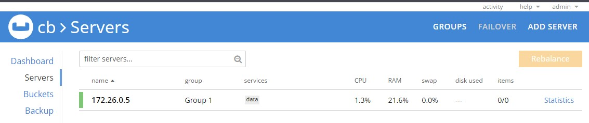 \
Нажатием кнопки 'Add Server' добавляем инстансы db1, db3, db4 в кластер\
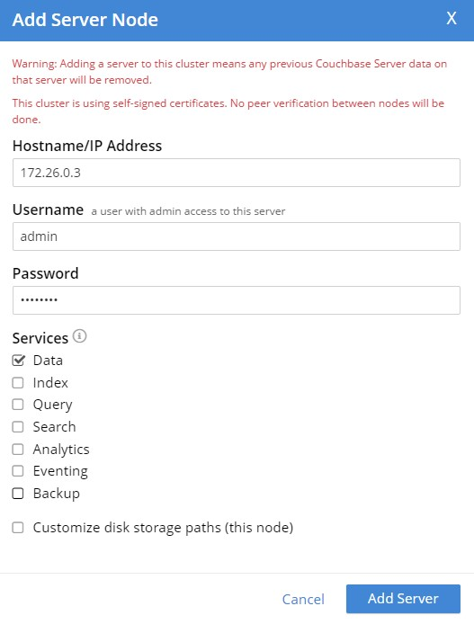 \
 \
Результат добавления:\
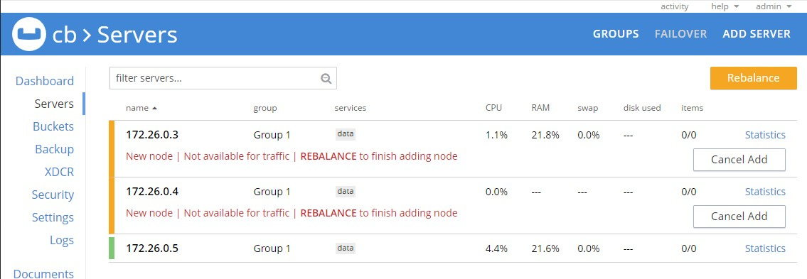 \
Делаем перебалансровку \
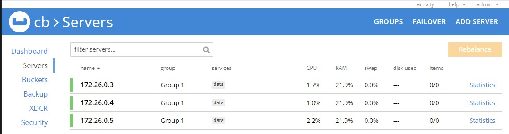 \
Добавляем инстанс БД содержащий индексы, запросы и др. и делаем перебалансировку \
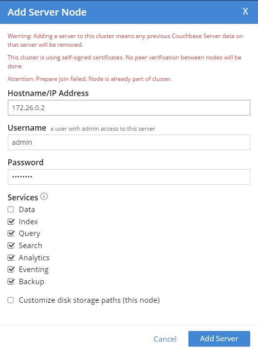 \
Делаем перебалансировку \
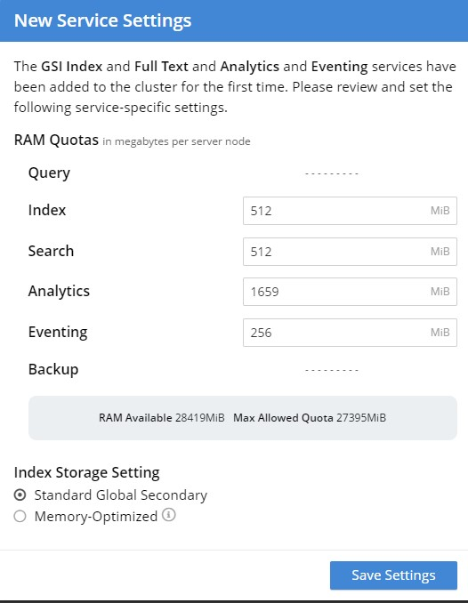 \
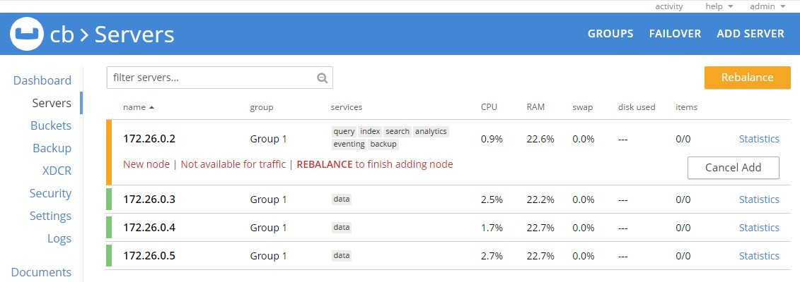 \
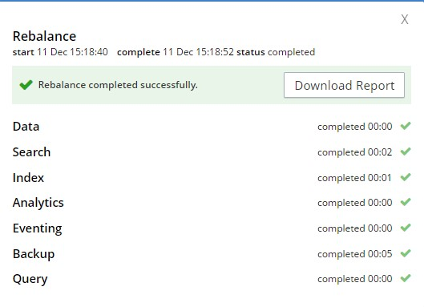 \
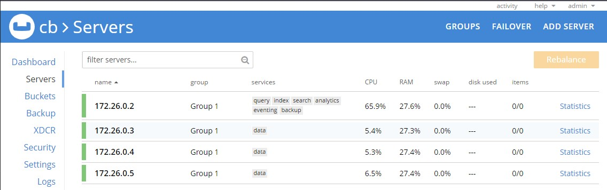 

## Наполнение тестовыми данными

Выполняем команду Buckets-> Sample Buckets\
Выбираем данные "travel-sample"\
Нажимаем "Load Sample Data". \
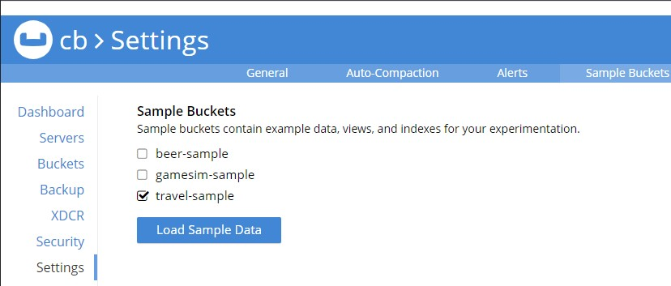 \
Результаты загрузки данных \
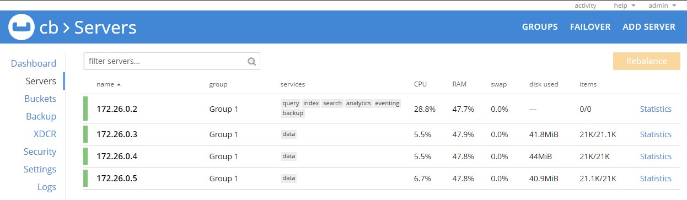

Выполнение тестового запроса данных \
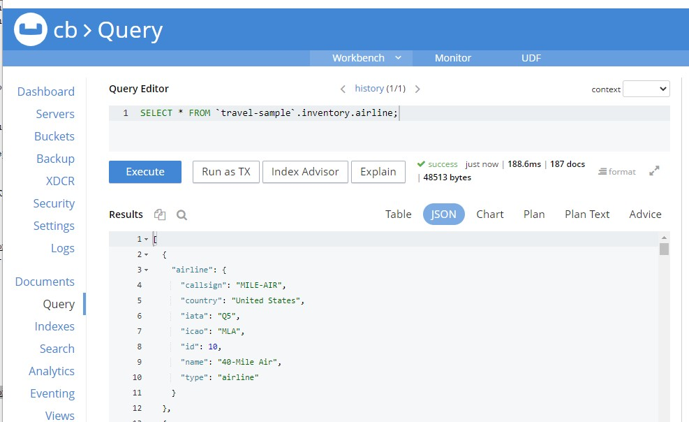

## Тестирование отказоустойчивости

После выполнения вышеописанных операций имеют следующую схему кластера:
* 3 реплицированные ноды (только хранение данных)
* нода для выполнения запросов, backup и др.

Следующая схема имеет следующие недостатки:
* при внезапном отключении ноды, отвечающей за выполнение запроса данных - пропадет возможность доступа к данным.

Чтобы повысить надежность данной схему необходимо добавить еще один инстанс БД, отвечающий за выполнение запросов. 

После загрузки тестовой БД, данные были распределены равномерно по 3 нодам (примерно по 21.000 записей). При жестком отключении инстанса БД. Необходимо вручную выполнить команду 'Failover' и перебалансровку поле чего данные из выпавшей ноды будут восставновлены, засчет реплицирования, в итоге количество записей на каждой активной ноде составит порядка 31.000. При автоматическом настройке автоматического выполнения команды 'Failover' восстановление будет происходить автоматически с небольшим лагом в зависимости от настроек ожидания восстановления  выпавшей ноды и объема данных.

Останавливание ноду:
C:\Users\kos>docker stop ebe/
Запускаем вручную команду 'Failover'/
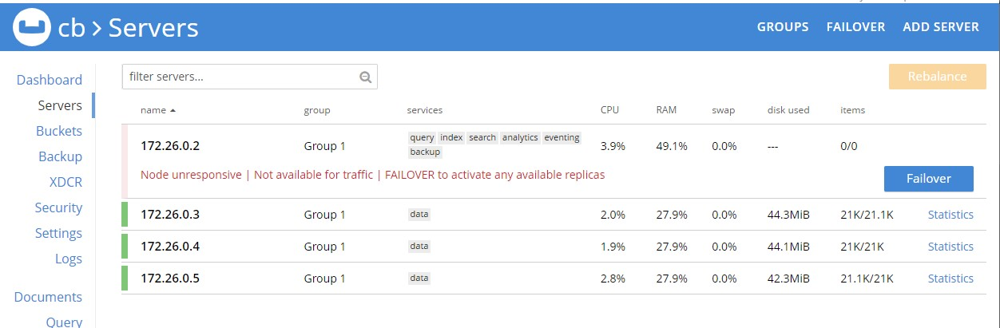\
Выполняем перебалансировку /
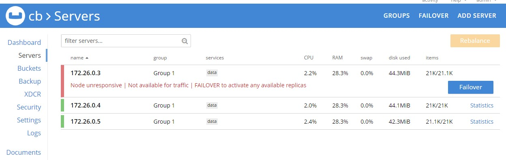\
Кластер БД готов к работе
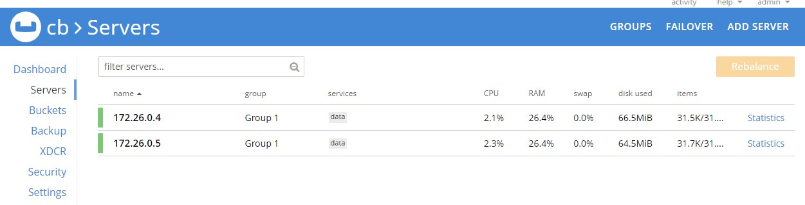\